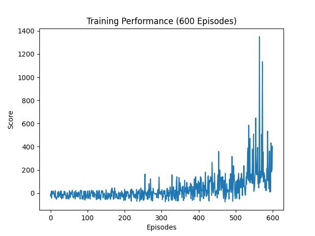

#  Flappy Bird AI using Deep Q-Learning (DQN)

This project implements a Flappy Bird agent trained using Deep Q-Learning (DQN) with PyTorch. The agent learns to play the game by interacting with a custom-built environment and improving its decisions through reinforcement learning.

##  Features

*  Custom Flappy Bird environment built using Pygame
*  Deep Q-Network (DQN) implemented with PyTorch
*  Experience Replay for stable learning
*  Target Network for improved training stability
*  GPU acceleration using CUDA
*  Reward shaping for faster convergence
*  Real-time gameplay visualization
*  Score tracking system
*  Comparative analysis between partially trained and fully trained models

##  Project Structure

* `game.py` – Game environment and physics
* `agent.py` – DQN agent implementation
* `model.py` – Neural network architecture
* `train.py` – Training loop
* `play.py` – Run trained agent

##  How it Works

The agent observes the state of the game (bird position, velocity, and pipe positions) and selects actions (flap or no flap) to maximize cumulative reward. Over time, it learns an optimal policy to navigate through pipes.

##  Results

Two models were trained to demonstrate learning progression:

* **Model (200 episodes):** Basic behavior, inconsistent performance
* **Model (600 episodes):** Improved survival and higher scores

This comparison highlights how reinforcement learning improves performance over time.

##  Tech Stack

* Python
* PyTorch
* Pygame

##  How to Run

```bash
# Train the agent
python train.py

# Run trained model
python play.py
```

##  Future Improvements

* Double DQN for better stability
* Prioritized Experience Replay
* Improved state representation
* Hyperparameter tuning
* UI enhancements and analytics

---

##  Key Learning

This project demonstrates how reinforcement learning agents can learn complex behaviors from scratch using trial and error, without explicit programming of rules.

## Training Results

## Model trained for 200 episodes

.png)

## Model trained for 600 episodes



These graphs show how the agent improves over time, with higher rewards achieved as training progresses.


